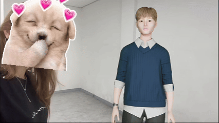
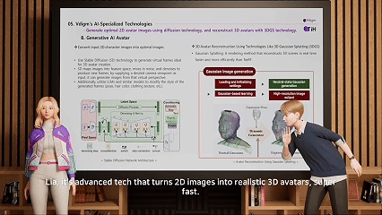
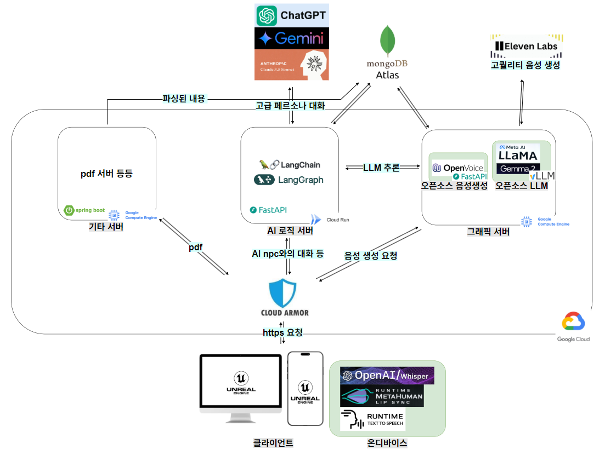
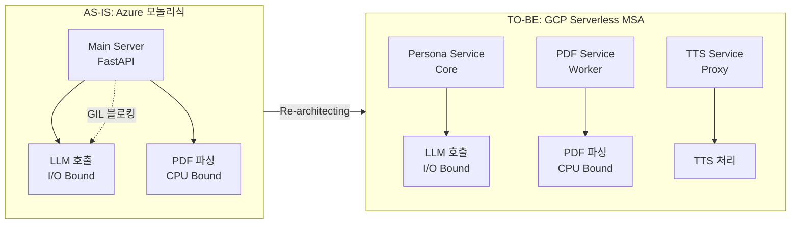
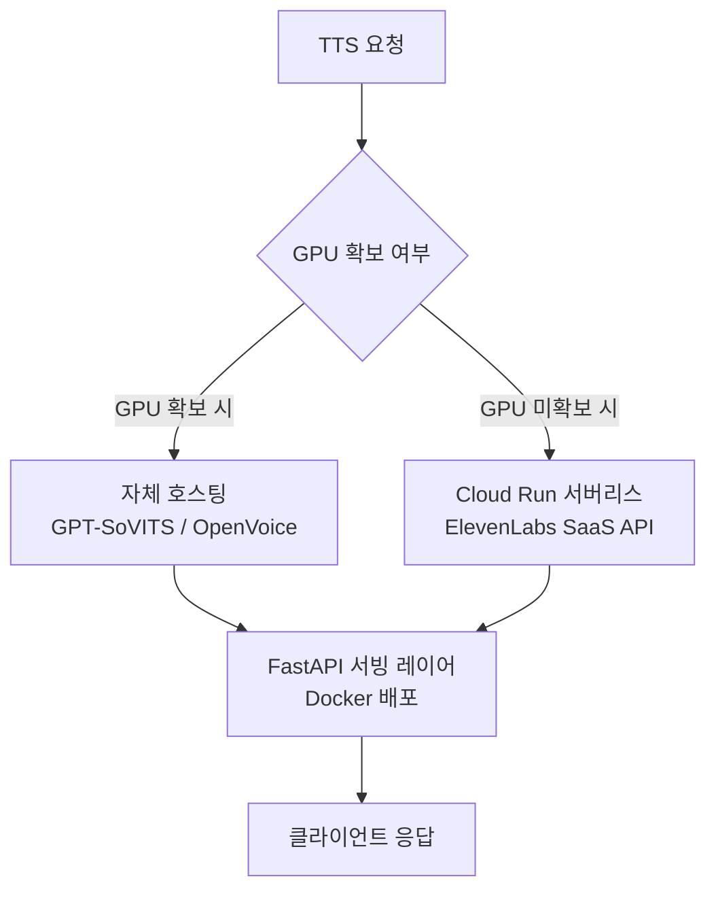
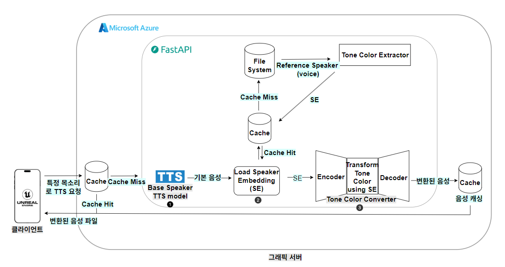
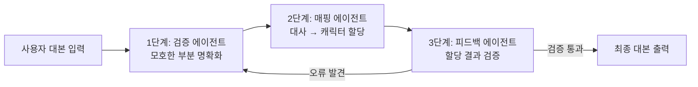
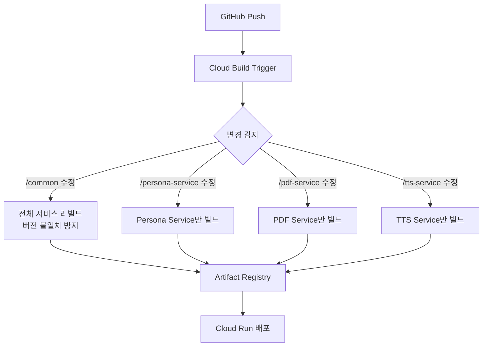

<h1 align="center">
  TIH (Talk, Interactive, Humanize)
  <br/>
  <sub>AI Streamer Platform — Persona chatbot & podcast generation</sub>
</h1>

<p align="center">
  
  
  
  
  
  
  
  <br/>
  
  
  
  
  
  
</p>

<p align="center">
  <a href="https://okjunseong.com/portfolio/6">📋 Portfolio</a> &nbsp;|&nbsp;
  <a href="https://okjunseong.com/tech/3">📝 Tech Post</a> &nbsp;|&nbsp;
  <a href="https://youtu.be/XvWagOY7w-8">🎬 Demo Video</a>
</p>

> ⚠️ **Notice:** 본 프로젝트는 (주)브이다임 재직 중 개발한 사내 프로젝트로, **소스코드 반출이 불가**합니다. 이 저장소에는 프로젝트의 구조, 설계 의도, 기술적 의사결정 과정을 정리한 **README 문서만 포함**되어 있습니다.

## 🎬 Demo

| AI NPC 실시간 채팅 | AI NPC 영상통화 |
|:---:|:---:|
|  |  |

| AI 팟캐스트 생성 |
|:---:|
|  |

<br/>

## 📌 프로젝트 소개

스트리머와 팬의 **소통 공백**을 메우고, LLM을 활용한 **콘텐츠 생성 자동화**로 새로운 가치를 창출하는 AI 플랫폼입니다.

방송이 끝난 후에도 팬들은 스트리머의 페르소나를 학습한 AI 에이전트와 실시간으로 대화하며 유대감을 이어갈 수 있습니다. 또한 사용자가 AI 캐릭터를 활용해 자율적으로 토론하는 팟캐스트 영상을 손쉽게 제작할 수 있는 창작 도구를 제공합니다.

[](https://youtu.be/XvWagOY7w-8)

### 개발 팀

<table>
  <tr>
    <td align="center" width="200">
      <br/>
      <b>손준성</b><br/>
      <sub>Backend / AI / Infra</sub><br/>
      <sub>시스템 설계, 전체 백엔드 개발,<br/>AI 에이전트, CI/CD, 비용 시뮬레이터</sub>
    </td>
    <td align="center" width="200">
      <b>신혁진</b><br/>
      <sub>Unreal Engine Client</sub><br/>
      <sub>UE5 클라이언트 개발,<br/>MetaHuman, Lip Sync 연동</sub>
    </td>
    <td align="center" width="200">
      <b>3D 모델링 팀</b><br/>
      <sub>3D Modeling</sub><br/>
      <sub>MetaHuman 캐릭터 모델링,<br/>애니메이션 에셋 제작</sub>
    </td>
  </tr>
</table>

> **담당 범위:** 시스템 아키텍처 설계, 전체 백엔드 개발 (인증, LangGraph/LangChain 기반 AI 에이전트, RAG 파이프라인, TTS 서비스, PDF 서비스 등), CI/CD 파이프라인 구축, 비용 시뮬레이터 개발, 클라이언트 연동

### 핵심 성과

| 지표 | 내용 |
|------|------|
| 체감 응답 속도 | SSE 스트리밍 파이프라인으로 초기 응답 시간 **8초 → 4초 (50% 단축)** |
| 캐릭터 할당 정확도 | 멀티 에이전트 검증 워크플로우로 대사 할당 **오류율 80% 감소** |
| 아키텍처 현대화 | Azure 모놀리식 → GCP Cloud Run 기반 **Serverless MSA 전환** |
| 사업 기여 | AI 팟캐스트 기능이 실제 **회사 IR 자료로 채택** |

<br/>

## 🏗️ 시스템 아키텍처

### 전체 구조



모든 클라이언트 요청은 **GCP Cloud Armor**를 통해 WAF/DDoS 방어를 거친 후 각 마이크로서비스로 라우팅됩니다. JWT 인증은 각 FastAPI 서비스의 미들웨어에서 처리하며, 시크릿 키는 **GCP Secret Manager**로 중앙 관리합니다.

> **설계 판단:** API Gateway를 별도로 두지 않고 각 서비스에서 JWT를 검증하는 방식을 선택했습니다. 현재 서비스 규모(3~4개)에서는 관리 포인트를 줄이는 것이 효율적이라는 팀 내 합의가 있었고, 서비스가 늘어날 경우 Gateway에서 인증을 중앙 처리하는 구조로 전환할 수 있도록 열어두었습니다.

### AS-IS → TO-BE: 아키텍처 현대화

초기에는 Azure 인프라 기반의 모놀리식 구조로 빠르게 MVP를 검증했습니다. 그러나 서비스가 성장하면서 **CPU Bound 작업(PDF 파싱)이 I/O Bound 작업(채팅)을 블로킹**하는 구조적 병목이 발생했고, Azure 크레딧 만료와 맞물려 GCP로의 마이그레이션을 단순 서버 이사가 아닌 **Re-architecting**의 기회로 삼았습니다.

[AS-IS 아키텍처 다이어그램 — Azure 모놀리식]

[TO-BE 아키텍처 다이어그램 — GCP Serverless MSA]



**변경의 핵심은 역할 분리입니다:**

- **Persona Service (Core):** 텍스트 기반의 가볍고 중요한 요청만 처리. LangChain/LangGraph를 통한 LLM 호출, RAG 검색 등 순수 대화 로직을 담당하며 높은 동시성을 유지합니다.
- **PDF Service (Worker):** CPU를 독점하는 무거운 작업을 별도로 격리. 이 서버에 과부하가 발생해도 채팅 서비스에는 영향이 없습니다(Fault Tolerance).
- **TTS Service (Proxy):** TTS 서비스의 백엔드 전환에 대비한 Facade 패턴. GPU 확보 시 자체 호스팅, 미확보 시 ElevenLabs SaaS로 메인 서버 코드 수정 없이 전환 가능합니다.

### 인프라 Note: 음성 합성 이중 경로



음성 합성은 비용/품질 트레이드오프에 따라 두 가지 경로로 운영했습니다. GPU(A100/L4/T4) 확보 시에는 오픈소스 모델을 자체 호스팅하여 비용을 절감하고, 그 외 기간에는 ElevenLabs SaaS + Cloud Run Proxy 구조로 전환하여 서비스 연속성을 유지했습니다. FastAPI 서빙 레이어는 Docker로 배포하여 환경 전환 시 빠르게 마이그레이션할 수 있도록 했고, GPU 종속적인 추론 엔진은 하드웨어(T4/L4/A100)마다 CUDA 호환성이 달라 의도적으로 도커라이징 대상에서 제외하고 환경에 맞게 직접 구성했습니다.

<br/>

## 🤖 PART 1. 실시간 교감형 AI 스트리머 에이전트

스트리머의 방송 내용과 말투를 학습하여 팬들과 실시간으로 소통하는 AI 에이전트입니다.

### KEY FEATURE 1: 체감 응답 속도 50% 단축 — SSE 스트리밍 파이프라인


**문제:** LLM 기반 챗봇의 초기 응답 시간이 평균 8초에 달해 대화의 흐름이 끊기고, 사용자 경험을 크게 저해했습니다.

**해결:** SSE(Server-Sent Events) 기반 스트리밍 파이프라인을 구축했습니다. LLM이 답변의 첫 문장을 완성하는 즉시 클라이언트로 전송하여 TTS 및 애니메이션을 시작하고, 그 시간 동안 나머지 문장을 병렬로 처리합니다. 이를 통해 사용자가 체감하는 초기 응답 시간을 **평균 4초로 50% 단축**했습니다.

### KEY FEATURE 2: 에이전틱 워크플로우 — 상황별 최적의 답변 생성


사용자의 질문은 일상 대화부터 방송 내용에 대한 깊이 있는 질문까지 다양합니다. Supervisor 에이전트가 질문의 의도를 파악하여 최적의 도구를 자율적으로 선택하고 활용하는 에이전틱 워크플로우를 설계했습니다.

**활용 도구:**

| 구분 | 도구 | 역할 |
|------|------|------|
| 내부 데이터 | 방송 대본 RAG | 과거 방송 내용 검색 및 요약 |
| 내부 데이터 | 커뮤니티 분석 | 팬 커뮤니티 여론 파악 |
| 내부 데이터 | 유저 활동 데이터 | 사용자 관심사 파악 |
| 외부 정보 | 웹 검색 | 최신 정보 확인 |

### TROUBLESHOOTING: 이벤트 루프 블로킹 해결



**문제:** FastAPI 비동기 환경에서 다수의 TTS 요청이 동시에 들어올 경우, CPU 집약적인 TTS 작업이 이벤트 루프를 점유(Blocking)하여 전체 시스템 응답이 느려지는 병목 발생.

**해결:**

1. CPU 집약적 TTS 작업을 별도 **Thread Pool**에 위임하여 이벤트 루프 블로킹 방지
2. 완성된 음성 파일 + 목소리 톤 정보(SE)를 **이중 캐싱**하여 중복 연산 제거
3. GPU 자원이 필요한 기능은 **독립 마이크로서비스로 완전 분리**

<br/>

## 🎙️ PART 2. LLM 기반 AI 팟캐스트 콘텐츠 생성

[AI 팟캐스트 제작 화면 — 캐릭터가 자율 토론하는 모습]

최대 4명의 AI 캐릭터 페르소나를 설정하고, 대본을 입력하거나 주제를 던져주면 캐릭터들이 자율적으로 토론하는 팟캐스트 영상을 생성합니다. 이 기능으로 제작된 팟캐스트는 실제 **회사 IR 자료로 채택**되어 기술의 사업적 가치를 증명했습니다.

### TROUBLESHOOTING: 캐릭터 대사 할당 오류 80% 감소

**문제:** 사용자가 입력한 대본의 화자 정보가 모호하여 LLM이 엉뚱한 캐릭터에게 대사를 할당하는 오류가 빈번하게 발생.

**해결:** LangGraph의 아이디어를 차용하여 3단계 멀티 에이전트 워크플로우를 도입했습니다.



이 구조를 통해 캐릭터 대사 할당 **오류율을 80% 이상 감소**시켰습니다.

<br/>

## 🗣️ TTS 모델 비교 검증

한국어 음성 합성을 위해 다수의 오픈소스 TTS 모델을 직접 검증했습니다.

| 모델 | 한국어 품질 | 상업적 이용 | 실시간 서빙 | 판단 |
|------|------------|------------|------------|------|
| OpenVoice | 영어 우수 / 한국어 부족 | ✅ | ✅ | 한국어 품질 미달로 제외 |
| StyleTTS | - | ❌ 한국어 모델 없음 | ✅ | 상업적 한국어 모델 부재 |
| F5-TTS | - | ❌ 한국어 모델 없음 | ✅ | 상업적 한국어 모델 부재 |
| CosyVoice | 우수 | ✅ | ❌ 대형 모델 | 단일 GPU 환경에서 실시간 서빙 어려움 |
| **GPT-SoVITS v2 Pro** | **양호** | **✅** | **✅** | **한국어 품질 대비 가장 효율적 → 채택** |

> 오픈소스 LLM(LLaMA, Gemma 2)과 vLLM 서빙 엔진도 자체 GPU 환경에서 검증했으나, 단일 GPU(T4) 환경에서의 동시 처리 한계와 추론 품질을 고려하여 프로덕션에서는 상용 LLM API를 채택했습니다. GPU 리소스 확보가 어려워진 시점에서 자체 호스팅의 ROI를 재평가하고, ElevenLabs SaaS로 전환하여 서비스 연속성을 우선시했습니다. 자체 호스팅은 비용 최적화가 가능한 시점에 전환할 수 있도록 Facade 패턴으로 설계해두었습니다.

<br/>

## 💰 비용 시뮬레이션 & 수익 모델 설계

서비스 출시가 지연되는 상황에서, 대규모 트래픽을 **Locust로 부하 시뮬레이션**하고 사용 패턴을 분석하여 비용 시뮬레이터를 직접 개발했습니다. 이를 통해 경영진에게 수익 모델을 제안하고 기획 방향 수정에 기여했습니다.

### LLM 모델별 비용 분석

| 메시지당 비용 계산기 | 모델별 비용 비교 |
|:---:|:---:|
|  |  |

채팅 1회당 토큰 사용량을 기반으로 **15개 이상의 LLM 모델 비용을 원화로 정량 비교**했습니다. Gemini 2.0 Flash(₩0.47/msg)부터 Claude 4.5 Sonnet(₩19.35/msg)까지, 품질과 비용의 트레이드오프를 데이터로 시각화했습니다.

### 서비스 수익 시뮬레이션


LLM + TTS 비용을 조합한 **채팅 1회당 예상 비용**(₩4.66)을 산출하고, 구독 티어별(Heavy/Medium/Light) 사용량과 과금 모델에 따른 **서비스 운영 수익 시뮬레이션**을 수행했습니다. 티어별로 LLM·TTS 모델 조합을 다르게 배정하여 비용 최적화와 사용자 경험의 균형점을 도출했습니다.

<br/>

## ⚙️ DevOps: CI/CD 파이프라인



**Monorepo + Selective Deployment** 전략을 채택했습니다.

- **Monorepo 구조:** 관리 효율을 위해 모든 서비스를 단일 레포지토리에서 관리합니다.
- **Selective Deployment:** 변경된 서비스만 빌드/배포되도록 Cloud Build 트리거를 구성했습니다.
- **Common 모듈 관리:** JWT 인증 미들웨어 등 공통 로직은 `/common`에 위치합니다. 각 서비스는 빌드 시 `/common`을 복사해가며, Cloud Build 트리거가 `/common` 경로를 감시하여 **공통 로직 수정 시 모든 서비스를 재빌드**합니다. 이는 서비스 간 버전 불일치를 방지하기 위한 보수적 전략입니다.

<br/>

## 🔧 Tech Stack

| 분류 | 기술 |
|------|------|
| **Backend** | Python, FastAPI, LangChain, LangGraph |
| **AI/ML** | RAG, GPT-SoVITS, OpenVoice, vLLM, LLaMA, Gemma 2 |
| **LLM API** | OpenAI GPT, Google Gemini, Anthropic Claude |
| **TTS SaaS** | ElevenLabs |
| **Infra** | GCP Cloud Run, Cloud Build, Cloud Armor, Secret Manager |
| **Database** | MongoDB Atlas |
| **Client** | Unreal Engine 5 (Whisper STT, MetaHuman Lip Sync 등 플러그인 활용) |
| **DevOps** | Docker, GitHub Actions, Cloud Build, Monorepo |

<br/>

## 📁 프로젝트 구조

```
tih/
├── common/                  # 공통 모듈 (JWT 미들웨어, 유틸리티 등)
├── persona-service/         # AI 페르소나 대화 서버 (Core)
│   ├── agents/              # Supervisor, RAG, 도구 에이전트
│   ├── routers/             # FastAPI 라우터
│   ├── services/            # 비즈니스 로직
│   ├── repositories/        # 데이터 접근 계층
│   ├── static/admin/        # 관리자 페이지
│   ├── Dockerfile
│   ├── cloudbuild.yaml
│   └── main.py
├── pdf-service/             # PDF 파싱 서버 (Worker)
│   ├── Dockerfile
│   └── cloudbuild.yaml
├── tts-service/             # 음성 합성 서버 (Proxy)
│   ├── Dockerfile
│   └── cloudbuild.yaml
├── test_client/             # 테스트 클라이언트
└── README.md
```

<br/>

## 📝 회고

모놀리식 아키텍처를 MSA로 현대화하고, 복잡한 AI 에이전트 워크플로우를 설계하며 시스템 전체를 보는 시야를 넓혔습니다. 특히 성능 병목을 찾아 해결하고, 제한된 GPU 리소스 안에서 5개 이상의 TTS 모델을 직접 비교 검증하며 기술적 의사결정 능력을 키울 수 있었습니다.

아직 대규모 실사용자 트래픽을 경험하지는 못했지만, 출시 지연 기간을 활용하여 **Locust 기반 부하 테스트로 대규모 트래픽을 시뮬레이션**하고, 비용 시뮬레이터를 직접 개발하여 경영진에게 수익 모델을 제안했습니다. 개발자의 역할이 코드 작성에 그치지 않고 **서비스의 비용 구조와 수익화 전략에도 직접 관여**할 수 있다는 것을 체감한 뜻깊은 프로젝트였습니다.

다시 처음부터 설계한다면, 초기 MVP 단계에서도 서비스 간 통신 인터페이스를 먼저 정의하고 시작했을 것입니다. 모놀리식에서 MSA로 전환하는 과정에서 API 계약이 명확하지 않아 마이그레이션 비용이 불필요하게 높아진 부분이 아쉬움으로 남습니다.

> **직접 설계/구현:** MSA 아키텍처, LangGraph 에이전트 워크플로우, RAG 파이프라인, SSE 스트리밍, TTS 모델 비교 검증 및 서빙, CI/CD 파이프라인, Cloud Run 배포 전략, 비용 시뮬레이터 개발 및 수익 모델 설계
>
> **기술 선정 및 연동:** UE5 온디바이스 플러그인 (Whisper STT, MetaHuman Lip Sync), ElevenLabs API 연동